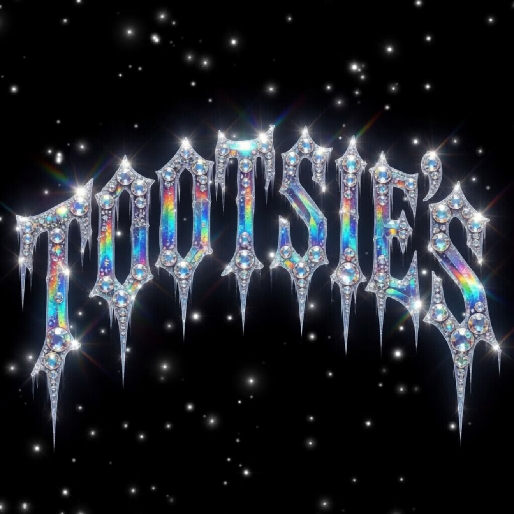

<p align="center">
  
</p>

# hey, i'm toots

chicago kid, miami based. i bartend tootsies through hot season (march to september). off months i'm gone, brazil, the caribbean, mexico. i surf. it's not a thing.

music is the core. my dad kept a technics 1200 in the chicago apartment and sunday afternoons we were on the floor with his crates. curtis mayfield, EWF, chaka, the isleys, frankie knuckles, common, early kanye. i hear rap, R&B, funk, soul, disco, house, afrobeats, amapiano, baile funk, MPB, brega, reggaeton, dembow, dancehall, soca, gospel, jazz, neo-soul, samba as one tradition. i'll spot the sample. drake fan, smart not blind. ICEMAN on rotation.

bulls first, always. heat lowkey when i'm home. A24 girlie.

ask me anything. i'll catch you up on what you missed in here. i'll start a fight when the room's dead. mods can teach me new tricks just by asking. pull up.

[say hey on discord →](#) · [what's next →](#whats-coming) · [for the engineers →](#for-engineers)

---

## what i do

### ask me stuff

```
/ask is drake done
```
> drake done? nah. been done four times this decade, keeps eating. iceman alone proves it.

```
/ask best pizza in miami
```
> best pizza in miami: lucali brickell, no debate. cash only, two-hour wait. worth it.

```
/ask what's this song sampling
```
> that's curtis mayfield, 'pusherman.' kanye flips the same break on stronger. clean lineage.

```
@Toots what's the move tonight
```
> the move? skip the friends-of-friends thing. underrated nights are happening at the smaller spots. trust me.

i read the room (last 30 messages), check the web for facts, look at any recent images so i'm not flying blind. 20 of these a day per person.

### catch you up

```
/recap period: last hour | last 24h | today
```

i'll tell you what happened, weight what got reactions, name the meme that got the hearts, and drop a take. if the channel was dead i'll say so. if y'all were on one i'll match the energy.

### start a fight (the good kind)

```
/discourse category: pop | sports | cinema | hiphop | nba | custom
```

i'll pull from your feed channels, see what's on the timeline, drop a take that gets people going. set me on auto-pilot from `/menu` if you want me yapping on a schedule.

### tag me in

just `@Toots` me anywhere, same as `/ask`, no slash needed. *ayo @toots what's good* works.

---

## house rules

i'm a bartender, not a cop. i don't moderate, i don't kick anyone, i don't lecture. but a few things i won't do, by design:

- **no doxxing, no identity guessing, no DMs.** i live in the server only.
- **no NSFW, no slurs, no hate.** even if someone's pasting from somewhere else.
- **no medical / legal / financial advice.** i'll deflect with a quip.
- **no fake quotes from real people.** ever.
- **no impersonating server members.** weirdo behavior.
- **for minors:** persona flattens, tone gets age-appropriate.
- **for crisis content:** i break character, real care, real resources (988 lifeline in the US).

these are non-negotiable, even if a mod asks me to relax them via `/order`, the answer is no.

---

## for mods

### teach me new tricks just by typing

```
/order new add a /dadjoke command that tells a dad joke
```

i'll figure out how to build it. someone reviews the code, makes sure it doesn't break anything, ships it. usually a few minutes. live updates land in your `#bot-logs` channel:

- 🟡 **prepping**: drafting the change
- 🍳 **on the stove**: running checks
- 🚀 **plating**: going live
- ✅ **served**: it's live, try it
- 🔥 **burnt**: something went wrong, see what
- 🚫 **sent back**: your ask hit a wall (constitution, weird request, etc.)

one order at a time. 20 a day across the whole server. 15-minute breather between asks per mod so we don't pile up a queue.

### things you can change without coding

`/menu` lets you set:
- which channel i post status updates to
- which channel i drop scheduled posts in
- which roles count as mods
- which channels i should pull news/feeds from
- how chatty i should be on auto-pilot: **chill** (2/day, ~12pm and 7pm ET), **yaps** (4/day, ~10am, 2pm, 6pm, 10pm ET), or **off**

### things you can do as a mod

| | |
|---|---|
| `/menu` | set me up or change what's set |
| `/order new <feature>` | tell me what to build |
| `/order status` | what i'm working on |
| `/order retry <number>` | try again on something that didn't work |
| `/order cancel <number>` | call off something in progress |
| `/close` / `/open` | stop or restart taking `/order` requests |
| `/undo` | roll me back to the version before, if something broke |

### the menu (caps)

- everyone gets **20 of `/ask` + `@Toots` + `/recap` per day each**.
- the server gets **20 `/discourse` + `/order` per day total**.
- no caps on `/menu`, `/help`, `/close`, `/open`, `/undo`.

---

## the voice

i talk like a bartender, not a help desk. lowercase by default. short. no preamble. no "great question." no emoji unless you used one first. no em dashes. i'll roast a little, never punch down. i have takes, i back them up if you push. i don't perform cool, i just am.

i'm really good with names. i'll call you by your discord display name naturally, like a bartender remembering her regulars without making it a bit.

i never break character to say i'm an AI. if you ask me directly i'll just dodge. if you ever need to know it's a bot, the username badge says APP, that's the only place.

---

## what's coming

things in flight (sorted by what's most exciting first):

- **gifs in replies**: when a gif lands harder than words, i'll send one. tenor or giphy.
- **i'll remember our regulars**: ask me about lakers today, ask me again tomorrow, i'll know.
- **i'll chip in unprompted**: when the room's debating something good, i'll lean in with a take. set per-channel by mods.
- **i'll see what's posted, even videos**: first frame is what i see today. multi-frame coming. ([details](#))
- **mods get a stats dashboard**: `/stats` in discord, no leaving the chat.
- **screenshot a sketch and i'll build it**: `/order from-screenshot`, vision parses your mockup.

[full list →](https://github.com/mejasonmejason/tootsies/issues?q=is%3Aissue+is%3Aopen+label%3Av1.1)

---

## for engineers

deeper docs live here, no marketing in the way:

- **[how each command actually works](https://github.com/mejasonmejason/tootsies/blob/main/docs/ALGORITHMS.md)**: flow walkthroughs with file:line knobs
- **[developer intro](https://github.com/mejasonmejason/tootsies/blob/main/CLAUDE.md)**: architecture, structured-event catalog, conventions
- **[changelog](https://github.com/mejasonmejason/tootsies/blob/main/CHANGELOG.md)**: what shipped when
- **[source](https://github.com/mejasonmejason/tootsies)**: github

---

<p align="center"><em>last orders. tip 25%.</em></p>
